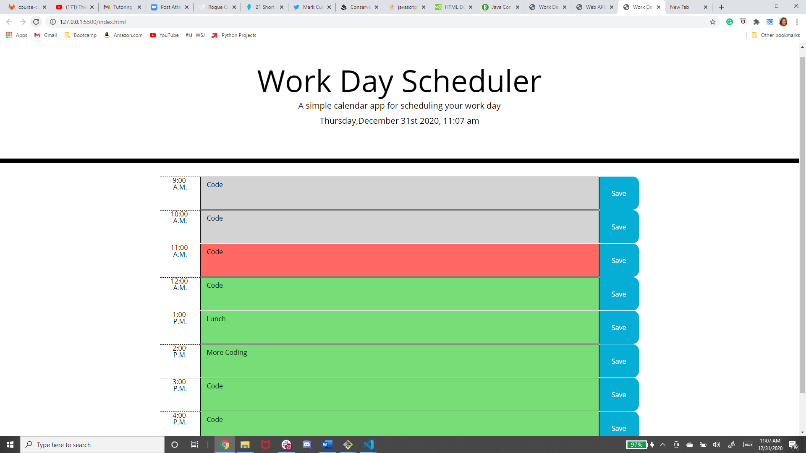

# third-party-api-scheduler
Create a simple calendar application that allows a user to save events for each hour of the day by modifying starter code. This app will run in the browser and feature dynamically updated HTML and CSS powered by jQuery. Use a library like Moment.js to work with dates and times.

===========


<br>

## Utilize moment.js to distinguish between past. present, or future

```
function updateHour () {
$('.time-block').each(function(){
let timeBlock= $(this).attr('id')
console.log(timeBlock)
if (currentTime > timeBlock) {
    $(this).addClass('past')
}
else if(currentTime < timeBlock) {
    $(this).addClass('future')
}
else{
    $(this).addClass('present')
}
})
}
updateHour()
```
<br>

## Save text to local storage

```
saveBtn.on('click', function (){
let inputValue=$(this).siblings('.description').val()
let id=$(this).parent().attr('id')
localStorage.setItem(id,inputValue)
});

$('#9 .description').val(localStorage.getItem('9'))
```
<br>

## Create time-blocks using HTML

```
        <div class='row time-block' id='9'>
          <div class="hour1 col-md-1">9:00 A.M.</div>
          <textarea class='description col-md-10' type='text' id= 'input'></textarea>
          <button class='saveBtn col-md-1 btn'>Save</button>
        </div>
```

<br>

## Built With

* [HTML](https://developer.mozilla.org/en-US/docs/Web/HTML)
* [CSS](https://developer.mozilla.org/en-US/docs/Web/CSS)
* [Javascript](https://developer.mozilla.org/en-US/docs/Web/JavaScript)
* [Bootstrap](https://getbootstrap.com/)
* [Jquery]

## Deployed Link

* [See Live Site](https://jas-f.github.io/third-party-api-scheduler/)

## License

This project is licensed under the MIT License 

See also the list of [contributors](https://github.com/your/project/contributors) who participated in this project.

## Prerequisites

Git hub,
Git lab,
Git bash,
Visual studio,
Google chrome,
Bootstrap,
JavaScript,
JQuery

## Authors

**Jasmine Franklin** 

- [Link to Portfolio Site](https://jas-f.github.io/responsive-portfolio/)
- [Link to Github](https://github.com/)
- [Link to LinkedIn](https://www.linkedin.com/in/jasmine-franklin-8b08ba121)

<p>&copy; UC Berkeley Extension Bootcamp.</p>